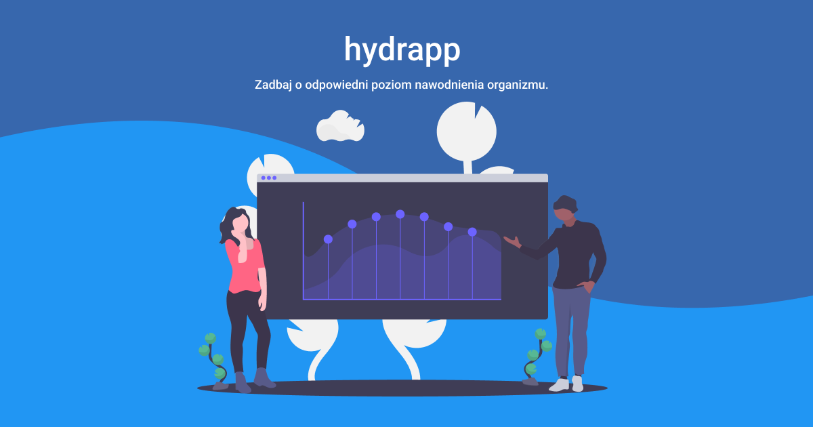

# hydrapp
Hydrapp to apliklacja "PWA" stworzona i opublikowana przy użyciu taskrunner GULP. Dzięki jego użyciu możliwe było wykorzystanie nowych technologii, jakich? Czytaj dalej lub [odpal stronę](https://przybylskimariusz.github.io/hydrapp/).

## Użyte narzędzia i technologie
To pierwsza aplikacja "PWA", którą zbudowałem. Jest prosta, intuicyjna i służy do mierzenia ilości wypitych w trakcie dnia szklanek wody. Jestem przekonany, że będę ją rozwijał, tak aby stała się w pełni funkcjonalną aplikacją :)

### Wykorzystane narzędzia i technologie

|  HTML 	|   CSS	|  JavaScript 	|
|---	|---	|---	|
|   BEM	| Sass 	|  Obiekt Date() 	|
|  openGraph 	|  Zagnieżdżone style 	|  Event Listener 	|
|   	|  Media queries 	|   manifest.json	|
|   	|  Zmienne w Sass 	|   	|

## Uruchomienie strony lokalnie

Aby uruchomić moją stronę na lokalnym serwerze wykonaj następujące kroki:

`npm install -g gulp-cli`

`npm install`

`gulp`

